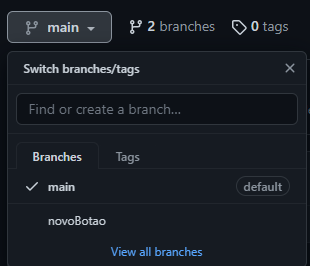

# Tutorial de Git e Github na prática

## Instalação do Git
* [Link com downloads](https://git-scm.com/downloads)

## Versionamento do projeto
* Acesse a pasta na qual o projeto está armazenado 
* Clique com o botão direito do mouse e selecione **Open Git Bash here**
* Digite `git init` para inicializar o repositório
  
  Será criada uma pasta chamada `.git`, **não** a apague
* Digite `git add .` para colocar os arquivos do projeto na  **área de staging**  

* Digite `git commit -m "primeira versão do projeto"` para versionar **localmente** o projeto 
* Digite `git branch -M "main"` para renomear a branch principal de `master` para `main`

## Criação de um repositório remoto no Github
* Acesse a sua conta do Github e clique em `New` para criar um novo repositório

  Preencha um nome para o repositório e preencha as informações do projeto, como a descrição
* Para enviar o commit do repositório local (isto é, em sua máquina) para um repositório na 
plataforma do Github, digite por inha de comando   
`git remote add origin <link do repositório` 

  `origin` é o nome utilizado para referenciar o link do repositório remoto 

* Dessa forma, o repositório local já está vinculado ao repositório remoto do Github,
entretanto a versão (isto é, o commit) não sobe automaticamente, por isso é necesário   
  digitar: **`git push -u origin main`**
* Por fim, recarregue a página do Github e verifique se o projeto foi versionado
**remotamente**

## E quando o projeto for alterado? 

* Ao editar um arquivo já versionado ou mesmo criar um novo arquivo que não existia na versão 
anterior, **NÃO** é necessário inicializar novamente o Git por meio do comando `git init`, 
sendo assim execute **APENAS** os seguintes comandos da ordem:
    `git add.`

    `git status` para verificar os arquivos que estejam na staging area

    `git commit -m "<escreva uma mensagem detalhado o que foi alterado>`

    `git push`

    Como é possível notar, também  **NÃO** é necessário renomear mais uma vez a branch (pois
    ela já estará renomada como `main`), além disso, o link do repositório remoto já estará 
    armazenado, por isso o comando `git remote add origin <link do repositorório>`só é
    utilizado uma única vez

* No Github será possível verificar todas as versões enviadas clicando em `commits`, de modo
que todas as alterações feitas estarão demonstradas  

  O sinal verde `+` representa o que foi adicionado/modificado no versionamento, enquanto o
  sinal vermelho `-` representa o que foi excluído de uma versão para outra

  ## Branch

* Até então, todos os versionamentos ocorreram na **ramificação principal (branch `main`)**
* Para criar uma nova branch, isto é, uma nova linha cronológica adicional/alternativa à 
principal que possa posteriormente se juntar à `main`, digite `git checkout -b <nome da nova branch>`,
assim o terminal Git sairá da branch `main` criará uma nova com o nome que desejar 
e entrará nela, por exemplo: `git checkout -b novoBotao`
* Com uma nova branch criada, utilize os comando já explicados:

    `git add .`

    `git status`

    `git commit -m "<escreva uma mensgem>"`

    `git push -u origin novoBotao`

* No Github, as branches aparecerão assim:
  
  

* Se o necessário retornar branch `main` pelo terminal do Git, digite `git checkout main`

